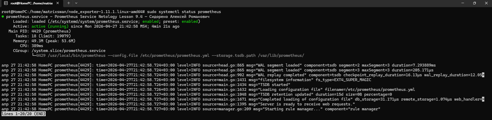
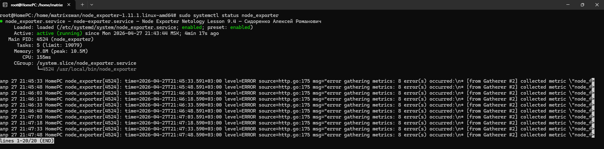
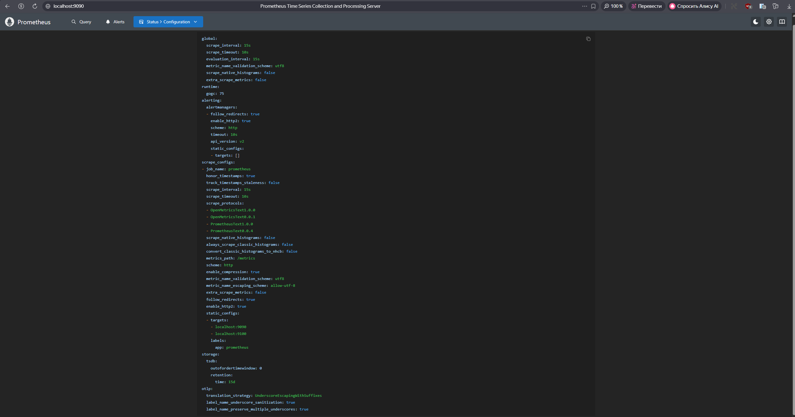
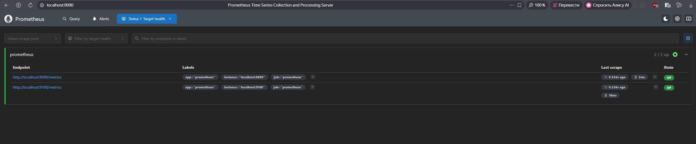
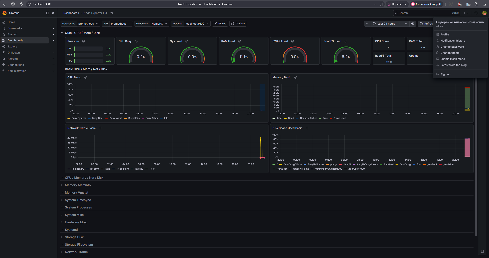

# Домашнее задание к занятию «Система мониторинга Prometheus» — Сидоренко Алексей Романович

### Задание 1. Установка Prometheus
Сервис успешно установлен, настроен запуск от пользователя `prometheus`. 
Статус работы сервиса:

---

### Задание 2. Установка Node Exporter
Сервис успешно установлен, настроен запуск от пользователя `node_exporter`. 
Статус работы сервиса:

---

### Задание 3. Подключение Node Exporter к серверу Prometheus
Конфигурация Prometheus обновлена, таргет добавлен.
Скриншот конфигурации (Status > Configuration):

Скриншот списка эндпоинтов (Status > Targets):

---

### Задание 4*. Установка Grafana
Grafana успешно установлена и запущена. 
Скриншот профиля пользователя:

---

### Задание 5*. Интеграция Grafana и Prometheus
Prometheus успешно добавлен в качестве Data Source в интерфейсе Grafana. Соединение проверено.
